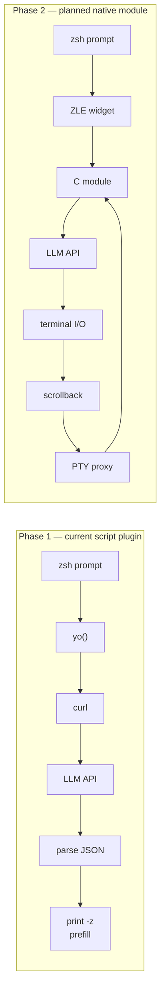

# Zoysh

[](https://github.com/stondo/zoysh/actions/workflows/ci.yml)
[](https://github.com/stondo/zoysh/releases)
[](LICENSE)

LLM-powered shell assistant for zsh. Zoysh is a zsh port and adaptation of
[Yosh](https://github.com/pizlonator/yosh), created by
[Fil Pizlo](https://github.com/pizlonator). It brings Yosh's `yo` interaction,
configuration conventions, provider behavior, and session model to zsh without
requiring a custom Bash build.

Type `yo <natural language>` at your zsh prompt. Get a command prefilled for review, or an inline answer.

> Zoysh never executes generated commands. It places them in the prompt so you can inspect and edit them first.

```
$ yo find all python files modified today
find . -type f -name "*.py" -newermt "$(date +%Y-%m-%d)"
# ↑ prefilled at your prompt — press Enter to run, or edit first

$ yo -c what does the -exec flag in find do?
The -exec flag runs a command on each matched file...
```

## Installation

### zinit

```zsh
zinit light stondo/zoysh
```

### antidote

```zsh
echo "stondo/zoysh" >> ~/.zsh_plugins.txt
```

### oh-my-zsh

```zsh
git clone https://github.com/stondo/zoysh.git ${ZSH_CUSTOM:-~/.oh-my-zsh/custom}/plugins/zoysh
# Then add 'zoysh' to your plugins=(... zoysh) in ~/.zshrc
```

### zplug

```zsh
zplug "stondo/zoysh"
```

### manual

```zsh
echo 'source /path/to/zoysh.plugin.zsh' >> ~/.zshrc
```

## Dependencies

| Dependency | Required | Notes |
|------------|----------|-------|
| **zsh >= 5.8** | Yes | |
| **curl** | Yes | API calls |
| **python3 >= 3.8** | Yes | Safe JSON request/response handling |

No zsh framework or compiled extension is required.

## Configuration

Config file: `~/.yoconf`. It is optional and is re-read before every `yo` command, so edits take effect immediately.

```conf
provider local
base_url http://127.0.0.1:8001/v1/
key local

history_limit 10
token_budget 4096
max_output_tokens 4096
timeout 30
server_web 1
```

| Directive | Default | Description |
|-----------|---------|-------------|
| `provider` | `local` | `local`, `qwen`, `kimi`, `deepseek`, `anthropic`, `openai`, `openrouter`, or `zai` |
| `model` | auto-detected locally | Preferred model ID; local servers are queried through `/models` |
| `base_url` | provider-specific | API base URL; omit it to use the selected provider's default below |
| `key` | provider key file | API key; local endpoints automatically use the placeholder `local` |
| `history_limit` | `10` | Maximum remembered `yo` exchanges |
| `token_budget` | `4096` | Approximate token budget for remembered conversation history |
| `max_output_tokens` | `4096` | Maximum tokens generated for one response |
| `timeout` | `30` | Seconds to wait for a connection or, when streaming, for the next chunk |
| `streaming` | `1` | Stream responses over SSE; `0` sends one blocking request |
| `continuation` | `0` | Multi-step plans: one `yo` query may queue several commands, prefilled one at a time |
| `scrollback_enabled` | `0` | Capture plan-step commands and output into a context ring (see below) |
| `scrollback_bytes` | `1048576` | Maximum size of the scrollback ring |
| `scrollback_lines` | `1000` | Recognized for compatibility; the script ring is byte-bounded |
| `server_web` | `1` | Enable hosted web search for Anthropic Messages and OpenAI Responses |
| `chat_prefix` | cyan `yo` heading | Text printed before chat responses |
| `color_prefix` | terminal reset | Base chat text style |
| `chat_reset` / `color_reset` | terminal reset | Style emitted after chat output |
| `enable_italic` / `disable_italic` | ANSI italic toggles | Rendering for Markdown emphasis |
| `enable_bold` / `disable_bold` | ANSI bold toggles | Rendering for Markdown bold |
| `enable_strikethrough` / `disable_strikethrough` | ANSI strike toggles | Rendering for Markdown strikethrough |
| `code_delimiter` | muted cyan | Rendering for inline math/code and fenced code blocks |

Where Yosh defines a hosted-provider default, Zoysh tracks it. Zoysh also adds
OpenRouter and local OpenAI-compatible backends. Set `model` or `base_url` to
override any default:

| Provider | Default model | Default endpoint |
|----------|---------------|------------------|
| `anthropic` | `claude-sonnet-4-5-20250929` | `https://api.anthropic.com/v1/messages` |
| `openai` | `gpt-5.2` | `https://api.openai.com/v1/responses` |
| `openrouter` | `z-ai/glm-5.2` | `https://openrouter.ai/api/v1/chat/completions` |
| `kimi` | `kimi-k2.5` | `https://api.moonshot.ai/v1/chat/completions` |
| `deepseek` | `deepseek-v4-flash` | `https://api.deepseek.com/chat/completions` |
| `qwen` | `qwen-plus` | `https://dashscope.aliyuncs.com/compatible-mode/v1/chat/completions` |
| `zai` | `glm-5.2` | `https://api.z.ai/api/paas/v4/chat/completions` |

Display values accept optional quotes and C-style escapes such as `\033`, `\n`, `\t`, and `\\`. For example, a plain no-color theme is:

```conf
chat_prefix "yo> "
color_prefix ""
color_reset ""
enable_italic ""
disable_italic ""
enable_bold ""
disable_bold ""
enable_strikethrough ""
disable_strikethrough ""
code_delimiter ""
```

Yosh's `scrollback_enabled`, `scrollback_bytes`, and `scrollback_lines`
directives are supported with a zsh-specific v1 design: capture is opt-in,
covers the commands zoysh itself queues, and does not wrap your whole
terminal. With `scrollback_enabled 1`, plan steps are prefilled as
`zoysh-run <command>`; the wrapper tees the command and its output into a
ring under `${XDG_STATE_HOME:-~/.local/state}/zoysh/scrollback` (bounded by
`scrollback_bytes`), preserves the exit status, and later `yo` calls include
the ring as context. You can also wrap any command yourself with
`zoysh-run <command>`. Ambient whole-terminal scrollback remains a
Yosh-only feature; the design notes in `doc/pty-design.md` explain why and
what a Phase 2 port would take.

If `~/.yoconf` doesn't exist, zoysh uses the local OpenAI-compatible API at `http://127.0.0.1:8001/v1/`. Before each request it reads `/models`, keeps the configured model if available, or selects the first model reported by the server. If the server is unavailable or has no loaded model, `yo` explains what to start or load.

### Changing the model

For a local server, `model` is optional. Set it when the server exposes multiple models and you want to prefer one:

```conf
provider local
model qwythos-9b-v2-mtp
base_url http://127.0.0.1:8001/v1/
key local
```

List available local model IDs with:

```sh
curl -s http://127.0.0.1:8001/v1/models | python3 -m json.tool
```

Verify the selected backend with `yo --help`. Local detection updates the running shell but never rewrites `~/.yoconf`.

To ignore the config file and override the model for one new zsh process:

```sh
ZOYSH_CONF=/dev/null ZOYSH_MODEL=another-model zsh
```

### API keys

Keys are resolved in this order: the `key` directive, `ZOYSH_API_KEY`, the
provider's standard environment variable (`ZAI_API_KEY` or
`OPENROUTER_API_KEY`), then its single-line key file. Set key-file permissions
to `0600`.

| Provider | Key file |
|----------|----------|
| anthropic | `~/.anthropickey` |
| openai | `~/.openaikey` |
| openrouter | `~/.openrouterkey` |
| kimi | `~/.kimikey` |
| deepseek | `~/.deepseekkey` |
| qwen | `~/.qwenkey` |
| zai | `~/.zaikey` |

## Usage

| Command | Description |
|---------|-------------|
| `yo <query>` | Generate a shell command (prefilled at prompt) |
| `yo -c <question>` | Ask a question, get inline answer |
| `yo --skip` | Prefill the next step of an active plan |
| `yo --abort` | Drop an active multi-step plan |
| `yo --clear` | Clear session memory |
| `yo --version` | Show the installed version |
| `yo --help` | Show help and current config |

### ZLE widget

Type your intent at the prompt, then press `M-y` (Alt+y): the buffer is sent
as the query and the generated command replaces it in place, without leaving
the line editor. With an empty buffer, `M-y` opens a small inline query
prompt. The result is always editable before you press Enter.

```zsh
$ find big files modified today<M-y>     # buffer becomes the generated command
```

The widget copies the command straight into `BUFFER` (the ZLE-safe
mechanism; `zle -U` would replay it through your keymap and can corrupt
commands when other widgets are bound to ordinary characters). Bind a
different key with:

```zsh
bindkey '\C-g' zoysh-widget
```

To keep M-y untouched, set `zstyle ':zoysh:widget' bind no` before the
plugin loads; the widget stays available for manual binding.

### Multi-step plans (off by default)

**This changes the feel of the tool, so it is opt-in**: set `continuation 1`
in `~/.yoconf`. With it, the model may answer a multi-step request with a
fenced `zoysh:plan` block holding one command per line. zoysh then:

1. Prefills step 1 at your prompt with a `plan step 1/N` marker. You press
   Enter to run it (or edit it first).
2. After each step runs, the next one is prefilled automatically.
3. Any other command you type drops the queue silently.

Nothing ever runs without your Enter. `yo --skip` prefills the next step
without running the current one, and `yo --abort` drops the plan. Follow-up
`yo` questions during a plan include the plan and the steps already run as
context. Queue state lives in
`${XDG_STATE_HOME:-~/.local/state}/zoysh/plan`.

## Features

- **Command generation** — natural language to zsh command, prefilled for review
- **ZLE widget** — press `M-y` on your typed intent to generate in place, never leaving the line editor
- **Inline Q&A** — ask questions without leaving the terminal
- **Streaming responses** — chat answers appear token by token over SSE, then re-render as terminal Markdown; thinking models stream with `<think>` reasoning hidden
- **Instant cancellation** — Ctrl-C during a request kills the helper process group, keeps any partial answer, and prints `yo: cancelled`
- **Multi-step plans (opt-in)** — queue several commands from one query, prefilled one at a time with review before every Enter
- **Session memory** — remembers conversation context within a session
- **Multi-provider** — Anthropic, OpenAI, OpenRouter, Kimi, DeepSeek, Qwen, z.ai, local models
- **Shell-aware** — includes OS, zsh version, working directory, and git branch in context
- **Thinking-aware** — strips `<think>` blocks from local reasoning models
- **Terminal Markdown** — renders headings, emphasis, lists, quotes, inline math/code, and fenced code
- **Hosted web search** — optional Anthropic and OpenAI server-side search tools
- **Private OpenAI requests** — sets `store: false` on Responses API calls
- **Multiline-safe** — preserves multiline answers and generated commands
- **Yosh-compatible configuration** — supports every portable `~/.yoconf` directive

## Privacy and safety

The query, current directory, operating system, zsh version, git branch, and bounded in-memory session history are sent to the configured API endpoint. Zoysh does not collect telemetry or persist conversation history. API keys are read from config or provider key files and are passed to curl through a file-descriptor-backed header source, keeping them out of curl's process arguments.

When `server_web 1` is used with Anthropic or OpenAI, the provider may send search queries to its web-search service. Set `server_web 0` to prevent zoysh from enabling those tools.

When `scrollback_enabled 1` is set, commands run through `zoysh-run` (plan steps, by default) have their output stored in the local ring and sent to the configured API as context of later `yo` calls. Keep capture off if you work with secrets on screen.

Generated commands are untrusted model output. Zoysh only prefills the prompt; review every command before pressing Enter, especially commands that modify files, permissions, packages, or remote systems. Prefilled text is placed in the editor buffer through a `zle-line-init` hook, so nothing executes until you accept the visible line.

## Release status and roadmap

### Phase 1: Script plugin (v0.3.0)
- [x] `yo` command via zsh function
- [x] Command prefilling via `print -z`
- [x] Session memory
- [x] Multi-provider support
- [x] Config file (`~/.yoconf`)
- [x] Python JSON request/response handling
- [x] Yosh-compatible config reload and display directives
- [x] Terminal Markdown rendering
- [x] Hosted web-search tools
- [x] Plugin manager compatibility (zinit, antidote, zplug, oh-my-zsh)
- [x] CI testing

Streaming responses are now part of Phase 1:

- [x] Streaming responses
- [x] Ctrl-C cancellation
- [x] ZLE widget (script implementation; the C module port remains Phase 2)
- [x] Multi-step task continuation (script implementation)
- [x] Scrollback capture for plan steps (script implementation; ambient capture remains Phase 2, see `doc/pty-design.md`)

Session memory includes earlier `yo` exchanges. Arbitrary terminal-output capture remains a Phase 2 feature because it requires a PTY proxy.

### Phase 2: C loadable module (experimental)

The first native subsystems have landed behind an opt-in switch:

- [x] Module scaffold: lifecycle, `zoysh-status`, config parser (C port of `~/.yoconf`)
- [x] API client: curl streaming with the same record protocol as the python helper
- [x] Script bridge: `zstyle ':zoysh:engine' engine module` (default stays `script`)
- [x] Ctrl-C cancellation preserved through the bridge
- [ ] Full `yo.c` port (session memory, ambient PTY scrollback per `doc/pty-design.md`, ZLE integration in C)

Build it against a configured zsh source tree (see the Development section);
`make check` never requires the module, and the CI module job is
allow-failure while it is experimental.

#### Using the module engine

```zsh
zmodload zsh/zoysh            # after installing zoysh.so on your module_path
zstyle ':zoysh:engine' engine module
zoysh-status                  # prints the loaded configuration summary
```

The module engine speaks the identical streaming protocol; answers render
byte-identically to the script engine (verified by the gated module tests).
Generated commands, plans, cancellation, and the widget all keep working
through the bridge, and API keys stay out of argv in both engines.

## Architecture



## Development

Run all release checks:

```sh
make check
```

The suite includes end-to-end tests against `tests/stub_server.py`, a
stdlib-only OpenAI-compatible stub that serves `/v1/models` and streaming or
non-streaming completions with canned scripts. No model backend is needed in
CI.

Install the script plugin under `PREFIX` (defaults to `~/.local`):

```sh
make install
```

The experimental C module is opt-in. `make module` requires a configured
zsh source tree plus libcurl headers, for example:

```sh
git clone --depth 1 --branch zsh-5.9 https://github.com/zsh-users/zsh ~/src/zsh
cd ~/src/zsh && ./Util/preconfig && ./configure --enable-multibyte && make -C Src zsh.mdh
make module ZSH_SRC=~/src/zsh          # builds zoysh.so
make check-module ZSH_SRC=~/src/zsh    # gated module tests (ZMODULE=1)
```

`make check` never builds the module. The module registers the `zoysh-status`
and `zoysh-call` builtins; run the gated suite after building it. If your
zsh tree needs extra include paths (for example for curses headers), pass
`ZSH_EXTRA_CFLAGS=-I...`.

See [CONTRIBUTING.md](CONTRIBUTING.md) for the contribution workflow and [SECURITY.md](SECURITY.md) for private vulnerability reporting.

## Credits

Zoysh exists because of [Yosh](https://github.com/pizlonator/yosh). Please visit
and support the original project.

- **Yosh author; original design and implementation**: [Fil Pizlo](https://github.com/pizlonator)
- **Yosh `yo.c` copyright holder**: Epic Games, Inc.
- **Zoysh port and modifications**: [Stefano Tondo](https://github.com/stondo)

Zoysh is an independent port and is not affiliated with or endorsed by Fil
Pizlo or Epic Games, Inc. Detailed provenance is recorded in [NOTICE](NOTICE).

## License

Zoysh is licensed under GPL-3.0-only. See [LICENSE](LICENSE) and
[NOTICE](NOTICE) for upstream provenance and copyright notices.
