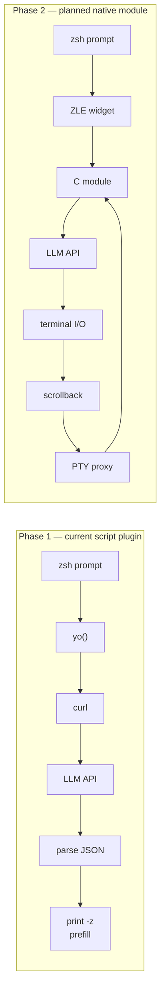

# Zoysh

[](https://github.com/stondo/zoysh/actions/workflows/ci.yml)
[](https://github.com/stondo/zoysh/releases)
[](LICENSE)

LLM-powered shell assistant for zsh. Port of [yosh](https://github.com/pizlonator/yosh) (Fil Pizlo's LLM-enabled bash fork) to zsh.

Type `yo <natural language>` at your zsh prompt. Get a command prefilled for review, or an inline answer.

> Zoysh never executes generated commands. It places them in the prompt so you can inspect and edit them first.

```
$ yo find all python files modified today
find . -type f -name "*.py" -newermt "$(date +%Y-%m-%d)"
# ↑ prefilled at your prompt — press Enter to run, or edit first

$ yo -c what does the -exec flag in find do?
The -exec flag runs a command on each matched file...
```

## Installation

### zinit

```zsh
zinit light stondo/zoysh
```

### antidote

```zsh
echo "stondo/zoysh" >> ~/.zsh_plugins.txt
```

### oh-my-zsh

```zsh
git clone https://github.com/stondo/zoysh.git ${ZSH_CUSTOM:-~/.oh-my-zsh/custom}/plugins/zoysh
# Then add 'zoysh' to your plugins=(... zoysh) in ~/.zshrc
```

### zplug

```zsh
zplug "stondo/zoysh"
```

### manual

```zsh
echo 'source /path/to/zoysh.plugin.zsh' >> ~/.zshrc
```

## Dependencies

| Dependency | Required | Notes |
|------------|----------|-------|
| **zsh >= 5.8** | Yes | |
| **curl** | Yes | API calls |
| **python3 >= 3.8** | Yes | Safe JSON request/response handling |

No zsh framework or compiled extension is required.

## Configuration

Config file: `~/.yoconf`. It is optional and is re-read before every `yo` command, so edits take effect immediately.

```conf
provider local
base_url http://127.0.0.1:8001/v1/
key local

history_limit 10
token_budget 4096
max_output_tokens 4096
timeout 30
server_web 1
```

| Directive | Default | Description |
|-----------|---------|-------------|
| `provider` | `local` | `local`, `qwen`, `kimi`, `deepseek`, `anthropic`, `openai`, `openrouter`, or `zai` |
| `model` | auto-detected locally | Preferred model ID; local servers are queried through `/models` |
| `base_url` | provider-specific | API base URL; omit it to use the selected provider's default below |
| `key` | provider key file | API key; local endpoints automatically use the placeholder `local` |
| `history_limit` | `10` | Maximum remembered `yo` exchanges |
| `token_budget` | `4096` | Approximate token budget for remembered conversation history |
| `max_output_tokens` | `4096` | Maximum tokens generated for one response |
| `timeout` | `30` | HTTP timeout in seconds |
| `server_web` | `1` | Enable hosted web search for Anthropic Messages and OpenAI Responses |
| `chat_prefix` | cyan `yo` heading | Text printed before chat responses |
| `color_prefix` | terminal reset | Base chat text style |
| `chat_reset` / `color_reset` | terminal reset | Style emitted after chat output |
| `enable_italic` / `disable_italic` | ANSI italic toggles | Rendering for Markdown emphasis |
| `enable_bold` / `disable_bold` | ANSI bold toggles | Rendering for Markdown bold |
| `enable_strikethrough` / `disable_strikethrough` | ANSI strike toggles | Rendering for Markdown strikethrough |
| `code_delimiter` | muted cyan | Rendering for inline math/code and fenced code blocks |

Hosted providers use yosh's provider defaults unless `model` or `base_url` is set explicitly:

| Provider | Default model | Default endpoint |
|----------|---------------|------------------|
| `anthropic` | `claude-sonnet-4-5-20250929` | `https://api.anthropic.com/v1/messages` |
| `openai` | `gpt-5.2` | `https://api.openai.com/v1/responses` |
| `openrouter` | `z-ai/glm-5.2` | `https://openrouter.ai/api/v1/chat/completions` |
| `kimi` | `kimi-k2.5` | `https://api.moonshot.ai/v1/chat/completions` |
| `deepseek` | `deepseek-v4-flash` | `https://api.deepseek.com/chat/completions` |
| `qwen` | `qwen-plus` | `https://dashscope.aliyuncs.com/compatible-mode/v1/chat/completions` |
| `zai` | `glm-5.2` | `https://api.z.ai/api/paas/v4/chat/completions` |

Display values accept optional quotes and C-style escapes such as `\033`, `\n`, `\t`, and `\\`. For example, a plain no-color theme is:

```conf
chat_prefix "yo> "
color_prefix ""
color_reset ""
enable_italic ""
disable_italic ""
enable_bold ""
disable_bold ""
enable_strikethrough ""
disable_strikethrough ""
code_delimiter ""
```

Yosh's `scrollback_enabled`, `scrollback_bytes`, and `scrollback_lines` directives are recognized for forward compatibility. The script plugin defaults scrollback capture to disabled and warns if it is enabled: capturing arbitrary child-process output requires the planned PTY-backed native module.

If `~/.yoconf` doesn't exist, zoysh uses the local OpenAI-compatible API at `http://127.0.0.1:8001/v1/`. Before each request it reads `/models`, keeps the configured model if available, or selects the first model reported by the server. If the server is unavailable or has no loaded model, `yo` explains what to start or load.

### Changing the model

For a local server, `model` is optional. Set it when the server exposes multiple models and you want to prefer one:

```conf
provider local
model qwythos-9b-v2-mtp
base_url http://127.0.0.1:8001/v1/
key local
```

List available local model IDs with:

```sh
curl -s http://127.0.0.1:8001/v1/models | python3 -m json.tool
```

Verify the selected backend with `yo --help`. Local detection updates the running shell but never rewrites `~/.yoconf`.

To ignore the config file and override the model for one new zsh process:

```sh
ZOYSH_CONF=/dev/null ZOYSH_MODEL=another-model zsh
```

### API keys

Keys are resolved in this order: the `key` directive, `ZOYSH_API_KEY`, the
provider's standard environment variable (`ZAI_API_KEY` or
`OPENROUTER_API_KEY`), then its single-line key file. Set key-file permissions
to `0600`.

| Provider | Key file |
|----------|----------|
| anthropic | `~/.anthropickey` |
| openai | `~/.openaikey` |
| openrouter | `~/.openrouterkey` |
| kimi | `~/.kimikey` |
| deepseek | `~/.deepseekkey` |
| qwen | `~/.qwenkey` |
| zai | `~/.zaikey` |

## Usage

| Command | Description |
|---------|-------------|
| `yo <query>` | Generate a shell command (prefilled at prompt) |
| `yo -c <question>` | Ask a question, get inline answer |
| `yo --clear` | Clear session memory |
| `yo --version` | Show the installed version |
| `yo --help` | Show help and current config |

## Features

- **Command generation** — natural language to zsh command, prefilled for review
- **Inline Q&A** — ask questions without leaving the terminal
- **Session memory** — remembers conversation context within a session
- **Multi-provider** — Anthropic, OpenAI, OpenRouter, Kimi, DeepSeek, Qwen, z.ai, local models
- **Shell-aware** — includes OS, zsh version, working directory, and git branch in context
- **Thinking-aware** — strips `<think>` blocks from local reasoning models
- **Terminal Markdown** — renders headings, emphasis, lists, quotes, inline math/code, and fenced code
- **Hosted web search** — optional Anthropic and OpenAI server-side search tools
- **Private OpenAI requests** — sets `store: false` on Responses API calls
- **Multiline-safe** — preserves multiline answers and generated commands
- **Yosh-compatible configuration** — supports every portable `~/.yoconf` directive

## Privacy and safety

The query, current directory, operating system, zsh version, git branch, and bounded in-memory session history are sent to the configured API endpoint. Zoysh does not collect telemetry or persist conversation history. API keys are read from config or provider key files and are passed to curl through a file-descriptor-backed header source, keeping them out of curl's process arguments.

When `server_web 1` is used with Anthropic or OpenAI, the provider may send search queries to its web-search service. Set `server_web 0` to prevent zoysh from enabling those tools.

Generated commands are untrusted model output. Zoysh only prefills the prompt; review every command before pressing Enter, especially commands that modify files, permissions, packages, or remote systems.

## Release status and roadmap

### Phase 1: Script plugin (v0.3.0)
- [x] `yo` command via zsh function
- [x] Command prefilling via `print -z`
- [x] Session memory
- [x] Multi-provider support
- [x] Config file (`~/.yoconf`)
- [x] Python JSON request/response handling
- [x] Yosh-compatible config reload and display directives
- [x] Terminal Markdown rendering
- [x] Hosted web-search tools
- [x] Plugin manager compatibility (zinit, antidote, zplug, oh-my-zsh)
- [x] CI testing

Streaming responses remain a possible Phase 1 enhancement:

- [ ] Streaming responses

Session memory includes earlier `yo` exchanges. Arbitrary terminal-output capture remains a Phase 2 feature because it requires a PTY proxy.

### Phase 2: C loadable module (planned)

Phase 2 is experimental and is not part of the script-plugin release. The repository currently contains module boilerplate only.

- [ ] Port `yo.c` core (LLM API logic) from yosh
- [ ] ZLE widget registration
- [ ] PTY proxy for scrollback capture
- [ ] Multi-step task continuation
- [ ] Ctrl-C cancellation (self-pipe signal trick)

## Architecture



## Development

Run all release checks:

```sh
make check
```

Install the script plugin under `PREFIX` (defaults to `~/.local`):

```sh
make install
```

The experimental C module is not part of the Phase 1 release. `make module` is opt-in and requires a configured zsh source tree plus the planned cJSON sources.

See [CONTRIBUTING.md](CONTRIBUTING.md) for the contribution workflow and [SECURITY.md](SECURITY.md) for private vulnerability reporting.

## Credits

- **Original concept and LLM logic**: [Fil Pizlo](https://github.com/pizlonator) — [yosh](https://github.com/pizlonator/yosh)
- **zsh port**: [Stefano Tondo](https://github.com/stondo)

## License

GPL-3.0-only. See [LICENSE](LICENSE) and [NOTICE](NOTICE).
